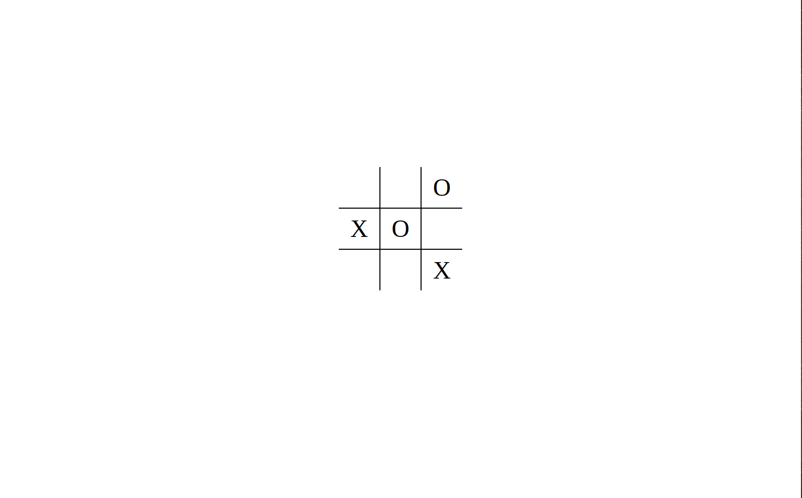

# Tic-Tac-Toe Game

Website: https://iamsuudi.github.io/tic-tac-toe/

---

## Tech Stack

- **Front End:** HTML | Javascipt | CSS

---

## Goal

My goal was practicing OOP in javascript as I implement this game engine. And the good practices of separating state logic from the UI controls within the context of vanilla JS.

---

## Key Features 

- Intro to the game.

- Instant UI interaction.

- Notifying the winner.

---

## What I learned

I learned that DOM elements and queries should not be responsible for storing or handling the implementation details of how our application works. That is not their responsibility, nor what they were designed to do. They shouldn't be concerned with storing details on the state of our game, nor handling the logic our game requires to function correctly. Instead, the DOM should be responsible for reading and displaying the application state to the user and providing an easy-to-use gateway to interact with the methods it needs to.

---

## Project Images

**Landing Page**

This is the landing page of the game.



---

## Setup

Installation:

```bash
git clone git@github.com:iamsuudi/tic-tac-toe.git
```

Running Live Server:

```bash
Open the `index.html` with any browser
```